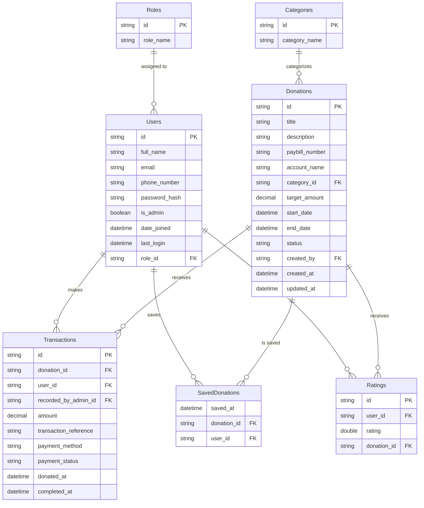

# JMCDonations

JMCDonations is a robust Django Rest Framework (DRF) application designed to manage donations, user authentication, and analytics for charitable organizations. It provides a secure and scalable backend for handling donor interactions, donation history, and administrative oversight.

## Features

-   **Authentication**:
    -   Secure user registration and login using JWT (JSON Web Tokens).
    -   Social authentication support (Google, Facebook) via `drf-social-oauth2`.
    -   Custom user model for extended profile management.

-   **Donations**:
    -   Secure endpoints for processing and recording donations.
    -   Donation history tracking for individual users.
    -   PDF receipt generation for successful donations.
    -   Saved donation preferences for quick recurring donations.
    -   **Donation Ratings**: Users can rate their donation experience.

-   **Analytics**:
    -   Comprehensive dashboard endpoints for administrators.
    -   Cash flow logging and reporting.
    -   Data export capabilities (Excel/CSV) for further analysis.

-   **Documentation**:
    -   Interactive API documentation using Swagger/OpenAPI (`drf-yasg`).

## Technology Stack

-   **Backend Framework**: Django 5.2.8
-   **API Framework**: Django Rest Framework (DRF)
-   **Authentication**: Djoser, SimpleJWT, Python Social Auth
-   **Database**: SQLite (Current), PostgreSQL (Planned)
-   **Utilities**: ReportLab (PDFs), OpenPyXL (Excel), Pillow (Images)

## Prerequisites

Before you begin, ensure you have the following installed:

-   Python 3.8+
-   pip (Python package manager)
-   Git

## Installation

1.  **Clone the repository**:

    ```bash
    git clone https://github.com/AbuArwa001/JMCDonations.git
    cd JMCDonations
    ```

2.  **Create and activate a virtual environment**:

    ```bash
    python3 -m venv .venv
    source .venv/bin/activate  # On Windows use: .venv\Scripts\activate
    ```

3.  **Install dependencies**:

    ```bash
    pip install -r requirements.txt
    ```

4.  **Apply database migrations**:

    ```bash
    python manage.py migrate
    ```

5.  **Create a superuser (Optional)**:

    ```bash
    python manage.py createsuperuser
    ```

6.  **Run the development server**:

    ```bash
    python manage.py runserver
    ```

    The API will be available at `http://127.0.0.1:8000/`.

## API Documentation

Once the server is running, you can access the interactive API documentation at:

-   **Swagger UI**: `http://127.0.0.1:8000/swagger/`
-   **ReDoc**: `http://127.0.0.1:8000/redoc/`

## Project Structure

-   `JMCDonations/`: Main project configuration settings.
-   `users/`: Handles user authentication, profiles, and management.
-   `donations/`: Manages donation logic, models, and history.
-   `analytics/`: Provides administrative insights and reporting tools.

## Database Schema



